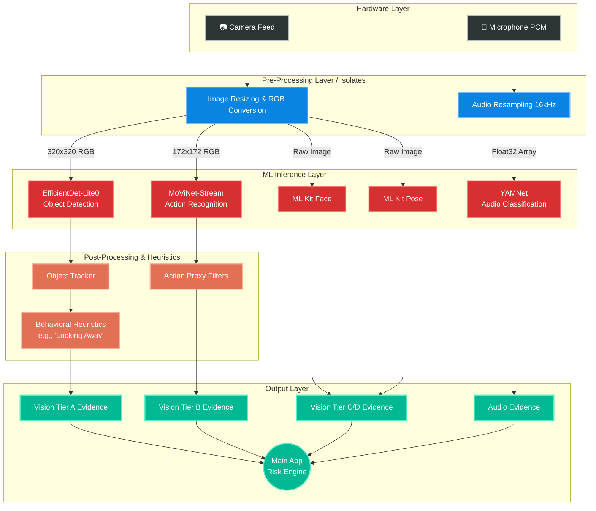
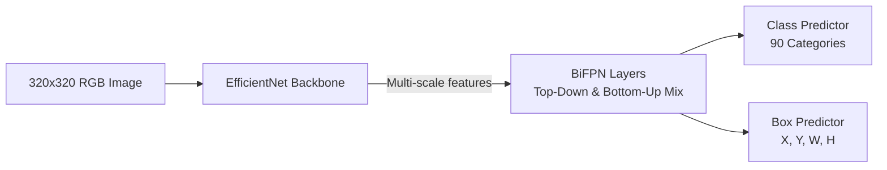
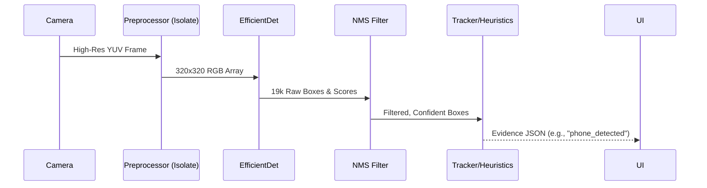
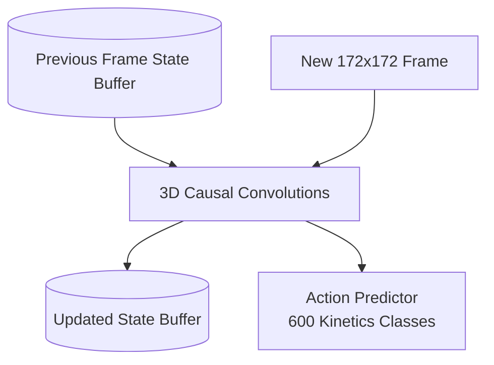
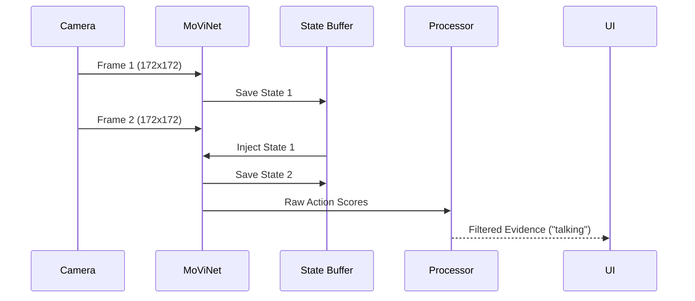
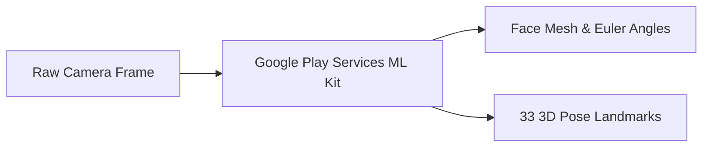
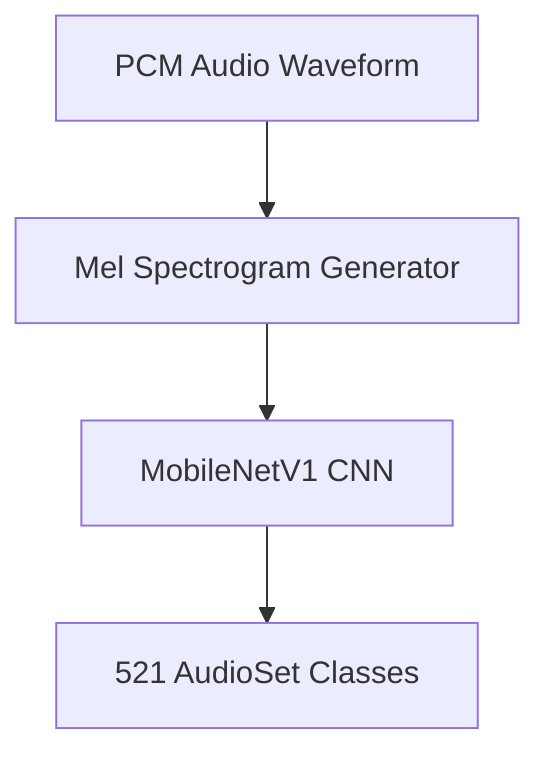

<div align="center">
  
  <h1>🛡️ Nirpadam Model Tester (AudVid)</h1>
  <p><strong>A highly advanced, isolated test harness for Edge AI Behavioral & Environmental Analysis.</strong></p>

  <p>
    
    
    
  </p>
</div>

---

## 📖 Table of Contents
1. [Project Overview](#-project-overview)
2. [Master Architecture](#-master-architecture)
3. [Deep Dive: The AI Models](#-deep-dive-the-ai-models)
    * [Tier A: EfficientDet-Lite0 (Object Detection)](#1-vision-tier-a-efficientdet-lite0)
    * [Tier B: MoViNet-Stream (Action Recognition)](#2-vision-tier-b-movinet-stream)
    * [Tier C & D: Google ML Kit (Face & Pose)](#3-vision-tier-c--d-ml-kit-face--pose)
    * [Audio: YAMNet (Sound Classification)](#4-audio-yamnet)
4. [Integration Guide: Porting to Production](#-step-by-step-integration-guide-porting-to-production)
5. [The Developer's Diary: Mistakes & Lessons Learned](#-the-developers-diary-mistakes--lessons-learned)

---

## 🎯 Project Overview
**Nirpadam Model Tester** acts as an isolated sandbox for testing complex, multi-modal machine learning pipelines locally on-device. Before integrating heavy ML models into the main **Nirpadam Risk Engine**, they are battle-tested here to validate latency, accuracy, memory leaks, and heuristic logic.

Think of this app as a "laboratory." It captures raw hardware data (Microphone PCM audio, Camera RGB frames), aggressively pre-processes them using background threads (Dart Isolates), feeds them into state-of-the-art quantized neural networks, and produces JSON-formatted "Evidence" items used for proctoring or risk assessment.

---

## 🏗️ Master Architecture

The overarching workflow follows a strictly unidirectional data flow: **Hardware ➔ Preprocessing (Isolate) ➔ Inference ➔ Post-Processing (Heuristics) ➔ Evidence Generation**.



---

## 🧠 Deep Dive: The AI Models

### 1. Vision Tier A: EfficientDet-Lite0
#### What is it? (In Layman's Terms)
Imagine a virtual eye that can look at a picture and draw tight, colored boxes around specific objects—like a person, a cell phone, or a laptop. That is "Object Detection." EfficientDet-Lite0 is a highly optimized version of this virtual eye designed to run very fast on mobile phones without draining the battery.

#### Purpose in the App
We use this model to understand the *environment* of the user. Is there another person in the room? Is the user holding a smartphone to cheat on a test? EfficientDet answers the "What" and "Where" questions for static objects in a single frame.

#### Architecture
It uses a **Bi-directional Feature Pyramid Network (BiFPN)**. 
Normally, AI models look at an image in one "resolution" at a time, making it hard to find a tiny phone far away and a large person close up simultaneously. BiFPN solves this by mixing "low-level" details (edges, colors) with "high-level" features (shapes, concepts) across multiple scales, going top-down and bottom-up.



#### Detailed Workflow
1. **Capture**: The camera grabs a high-res YUV image.
2. **Isolate Preprocessing**: We send it to a background thread to crop, rotate, convert to RGB, and shrink it exactly to 320x320 pixels.
3. **Inference**: The model analyzes the 320x320 image.
4. **Raw Output**: It spits out 19,206 possible boxes and 19,206 scores for 90 classes.
5. **NMS (Non-Maximum Suppression)**: We run custom logic to filter out overlapping boxes (e.g., if it draws 5 boxes on one phone, we only keep the best one using an Intersection-over-Union algorithm).
6. **Tracking & Heuristics**: The boxes are fed to our `ObjectTracker` (to remember "Person #1" across frames) and `BehavioralFeatureExtractor` (to see if "Person #1" suddenly moved very fast).



---

### 2. Vision Tier B: MoViNet-Stream
#### What is it? (In Layman's Terms)
A regular image model (like Tier A) only understands a frozen moment in time. It can see a hand near a face, but it doesn't know if the person is scratching their nose or whispering into a microphone. **MoViNet** (Mobile Video Network) understands *motion*. It looks at a sequence of frames over time to recognize "Actions."

#### Purpose in the App
We use MoViNet to catch complex behaviors like "talking on phone", "stretching", or "sign language". This is crucial for catching subtle cheating behaviors that simple object detection misses.

#### Architecture
It uses a **3D Convolutional Neural Network with Causal Stream Buffers**.
Normally, video AI models need you to pass an entire 5-second video file at once, which consumes massive memory. MoViNet solves this by maintaining a tiny internal "memory buffer." You pass it frame #1, it saves the state. Pass frame #2, it updates the state based on frame #1. This allows real-time streaming video analysis with near-zero latency.



#### Detailed Workflow
1. **Capture**: The camera streams frames continuously.
2. **Preprocessing**: The frame is converted to RGB and resized to 172x172 pixels.
3. **Stateful Inference**: The frame, along with the *previous state*, is fed into the TFLite model.
4. **Action Output**: The model outputs probabilities for 600 actions.
5. **Action Proxy Mapping**: We pass this through our `VisualEvidenceProcessor`. For example, if MoViNet detects "beatboxing" or "answering questions", our processor translates that into a "suspected talking" heuristic evidence.



---

### 3. Vision Tier C & D: ML Kit (Face & Pose)
#### What is it? (In Layman's Terms)
These are Google's proprietary, ultra-fast algorithms designed specifically to find human faces and draw stick-figure skeletons over bodies. 

#### Purpose in the App
* **Tier C (Face)**: We track the user's head rotation (Pitch, Yaw, Roll). If they turn their head left for 5 seconds, we flag it as "Looking Away."
* **Tier D (Pose)**: We track 33 points on the body. We can use this to detect if a person slumps out of their chair or reaches out of frame.

#### Architecture
Under the hood, these use Google's **BlazeFace** and **BlazePose** architectures. They are highly optimized for mobile DSPs/NPUs (Digital Signal Processors/Neural Processing Units) and bypass the standard CPU TFLite pipeline entirely.



#### Detailed Workflow
1. **Capture**: We take the native Android YUV frame.
2. **Metadata Tagging**: Instead of resizing, we tag it with the camera rotation and lens direction.
3. **Native Call**: Passed directly to ML Kit via platform channels.
4. **Processor**: The `FaceEvidenceProcessor` checks if `yaw > 30 degrees`. If yes, it creates an evidence flag.

---

### 4. Audio: YAMNet
#### What is it? (In Layman's Terms)
YAMNet is an AI that has learned to recognize 521 different sounds by looking at pictures of audio (spectrograms). It can tell the difference between a dog bark, a siren, and human speech.

#### Purpose in the App
To monitor the acoustic environment. In a proctored setting, we need to know if someone is typing furiously off-screen or if a secondary voice is whispering answers.

#### Architecture
It uses a **MobileNetV1** architecture applied to **Mel Spectrograms**.
Audio waves are mathematical messes. YAMNet first chops the audio into chunks, calculates the frequencies, and creates an image (spectrogram) representing the sound. Then, a standard image-recognition neural network looks at that "picture of sound" to classify it.



#### Detailed Workflow
1. **Microphone**: Captures 16-bit PCM audio at 16kHz.
2. **Buffering**: Dart collects bytes until we have exactly 15,600 samples (0.975 seconds of audio).
3. **Float Conversion**: Int16 bytes are divided by `32768.0` to create a Float32 array `[-1.0, 1.0]`.
4. **Inference**: YAMNet processes the 15,600 floats.
5. **Proxy**: The `AudioEvidenceProcessor` flags if "Speech" or "Typing" crosses our confidence threshold.

---

## 🚀 Step-by-Step Integration Guide: Porting to Production

When moving this tester code into the main Nirpadam Application, follow this exact sequence:

### Step 1: Dependencies
Update the `pubspec.yaml` in the main app to include the exact versions used in the tester:
```yaml
dependencies:
  tflite_flutter: ^0.12.1
  camera: ^0.12.1
  record: ^7.1.1
  google_mlkit_face_detection: ^0.15.1
  google_mlkit_pose_detection: ^0.16.1
```

### Step 2: Assets Migration
Move the `assets/models/` and `assets/config/` directories to your main app. **Do not forget** to declare them in the `pubspec.yaml` so they bundle correctly:
```yaml
flutter:
  assets:
    - assets/models/
    - assets/config/
```

### Step 3: Service Layer Porting
Copy the entire `lib/services/` directory into your main app's architecture. This includes:
* **The Models**: `efficientdet_model.dart`, `movinet_stream_model.dart`, `yamnet_model.dart`.
* **The Processors**: `audio_evidence_processor.dart`, `visual_evidence_processor.dart`, etc.
* **The Heuristics Engine**: `object_tracker.dart`, `behavioral_feature_extractor.dart`.

### Step 4: Model Singleton Initialization (CRITICAL)
Models are heavy and take time to load. In your main app's bootstrap phase (e.g., `main.dart` or a Dependency Injection setup like `GetIt`), initialize them **ONCE**:
```dart
final efficientDet = EfficientDetModel();
await efficientDet.load();

final movinet = MovinetStreamModel();
await movinet.load();
```
*Pass these singletons down to your Risk Engine. Never instantiate them on a UI screen!*

### Step 5: Orchestrator Hookup
In your main app's Risk Engine:
1. Start the camera and mic streams.
2. Feed the frames/audio buffers into the Preprocessing Isolates.
3. Await the inference.
4. Pass the inference to the Processors.
5. Push the resulting `Evidence` objects to your backend.

---

## 🛠️ The Developer's Diary: Mistakes & Lessons Learned

During the development of this harness, we hit several severe roadblocks. Here is what went wrong, why it happened, and how to avoid it in production.

### 1. General Flutter & Async Issues
* 🔴 **The Mistake: `Bad state: Cannot add new events after calling close` crashes.**
  * **Why it happened**: When the user pressed "Stop", the camera stream was closed. However, a heavy ML frame was still processing in the background. A fraction of a second later, the ML process finished and tried to `add()` its result to the closed stream, crashing the app.
  * **The Fix**: We added `if (_stopRequested) return;` checks *immediately before* every `stream.add()` call. 
  * **Production Takeaway**: Always respect asynchronous gaps in Flutter. When shutting down sensors, assume pending operations will return later and check cancellation flags.

* 🔴 **The Mistake: Models Breaking Upon Navigation (The Singleton Trap)**
  * **Why it happened**: Originally, `detector.dispose()` was called in the test screen's `dispose()` method. When the user pressed the back button, the C++ TFLite pointers were destroyed. Going back to the screen resulted in dead models.
  * **The Fix**: Model lifecycles must be entirely decoupled from UI lifecycles. Models must be instantiated globally and live as long as the application session.

### 2. EfficientDet-Lite0 (Tier A)
* 🔴 **The Mistake: Bounding Boxes Flying Off-Screen**
  * **Why it happened**: The TFLite model we used sometimes returned absolute pixel coordinates (`0 to 320`) instead of normalized decimals (`0.0 to 1.0`). Our overlay painter assumed normalized coordinates, so a box at `Y: 150` was drawn 150 screens down!
  * **The Fix**: We added a dynamic check inside `efficientdet_model.dart`: `if (yMax > 2.0) { yMax = yMax / 320.0 }`.
  * **Production Takeaway**: Never trust raw tensor outputs to remain consistent if you switch models. Always normalize your coordinate systems explicitly.

* 🔴 **The Mistake: Image Squeezing in the UI**
  * **Why it happened**: We forced the `CameraPreview` inside a `Container` with a fixed 50% screen height. Because the camera has a strict aspect ratio (e.g. 16:9), Flutter "shrank" the whole feed to fit inside the box, causing the bounding boxes (which calculated sizes based on the screen) to misalign completely.
  * **The Fix**: Removed fixed heights. Wrapped the camera in an `AspectRatio` widget inside a zoomable `InteractiveViewer`. Let the camera dictate its own height.

### 3. MoViNet-Stream (Tier B)
* 🔴 **The Mistake: Stale JSON Evidence on Camera Stalls**
  * **Why it happened**: If the camera dropped frames (which happens under heavy load), the MoViNet loop skipped processing. But it emitted *nothing*. The UI (and backend) just kept showing the last known state indefinitely, assuming everything was fine.
  * **The Fix**: We implemented a `framesProcessed == 0` check. If no frames run, it explicitly creates an `isUnavailable: true` evidence item. 
  * **Production Takeaway**: Silence from a model is not "safe". Silence is a failure. Always emit heartbeat/unavailable evidence so the Risk Engine knows a sensor failed.

### 4. Hardware Limitations
* 🔴 **The Mistake: Log Spam `Device error received, code 3 / 5`**
  * **Why it happened**: Running EfficientDet, MoViNet, ML Kit Face, and ML Kit Pose simultaneously at 30 FPS absolutely crushes mobile hardware. The Camera2 API physically ran out of memory buffers (`code 3`) and started dropping frames at the hardware level.
  * **The Fix**: We implemented `visionFrameSampleIntervalMs` in `TesterConfig` to throttle the capture rate (e.g., dropping it to 2-3 frames per second).
  * **Production Takeaway**: **Duty Cycling is mandatory.** You cannot run all tiers at 100% capacity in production. Run Tier A at 2 FPS. Only spin up MoViNet (Tier B) if Tier A suspects a problem. Turn models off when battery is low.