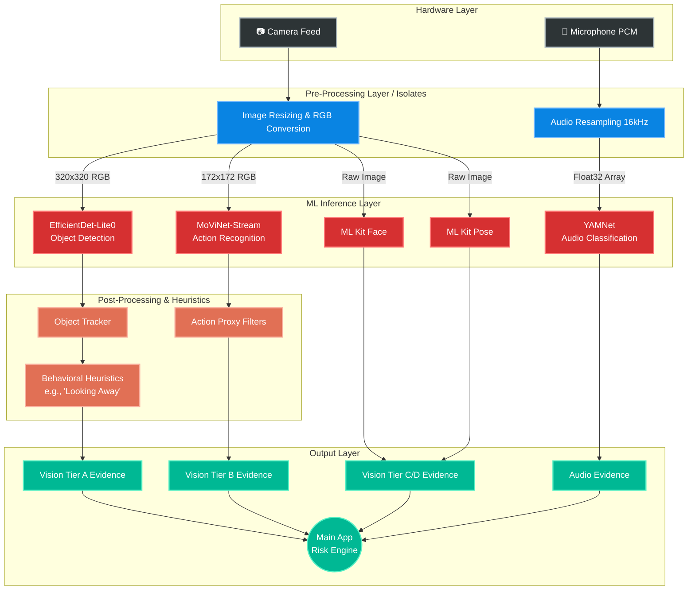
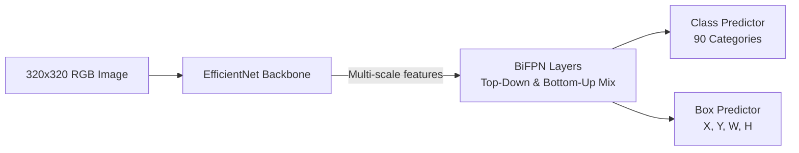
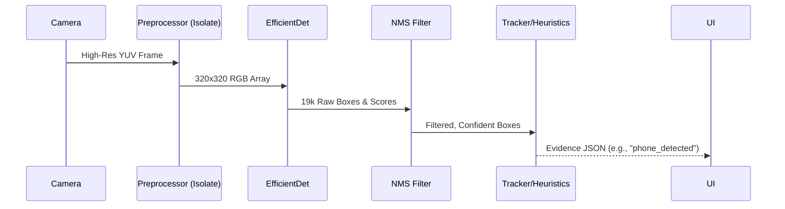
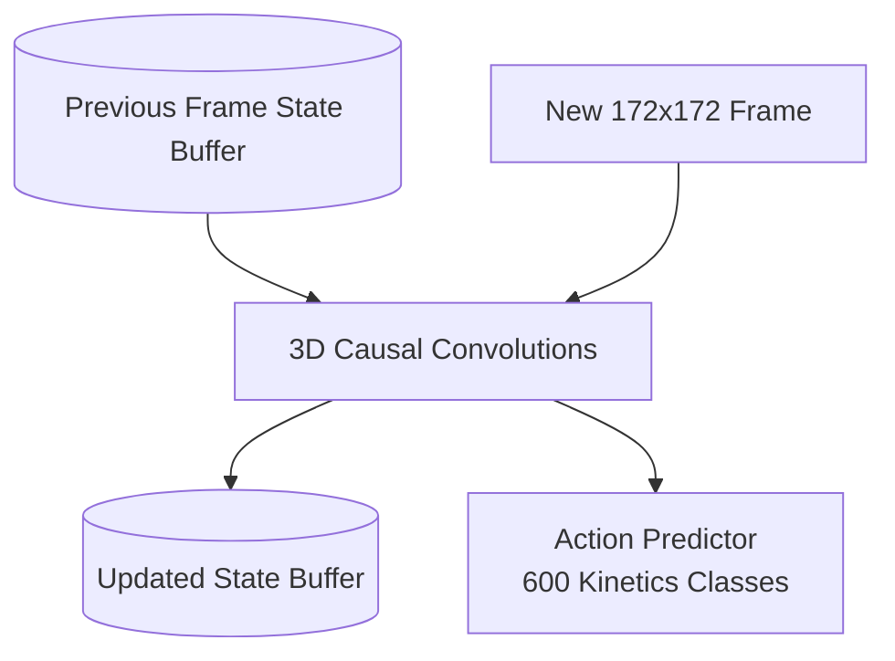
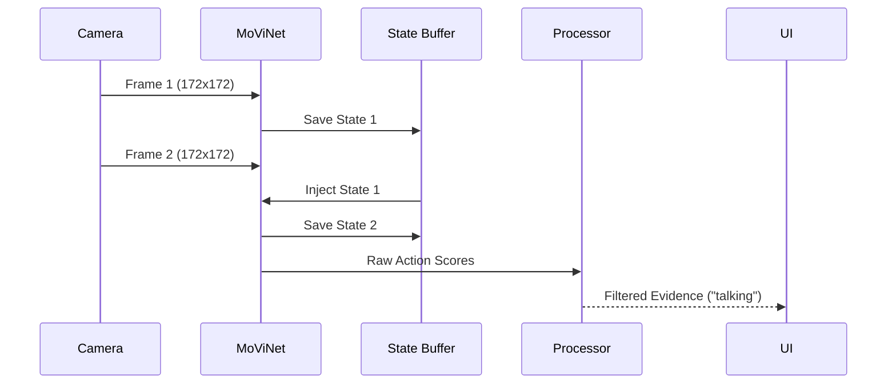
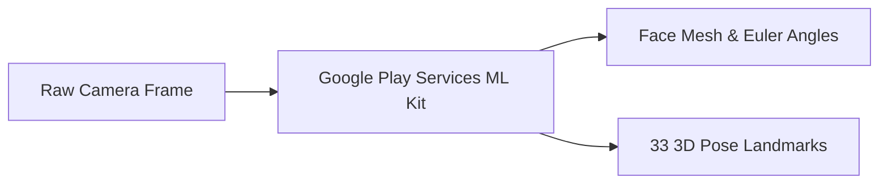
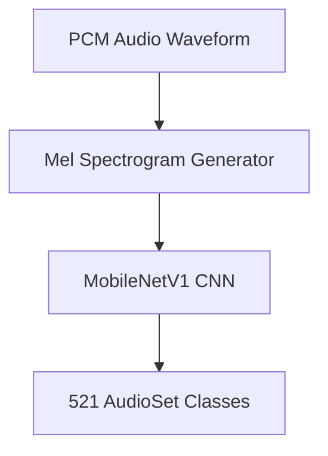

<div align="center">
  
  <h1>🛡️ Nirpadam Model Tester (AudVid)</h1>
  <p><strong>A highly advanced, isolated test harness for Edge AI Behavioral & Environmental Analysis.</strong></p>

  <p>
    
    
    
  </p>
</div>

---

## 📖 Table of Contents
1. [Project Overview](#-project-overview)
2. [Master Architecture](#-master-architecture)
3. [Deep Dive: The AI Models](#-deep-dive-the-ai-models)
    * [Tier A: EfficientDet-Lite0 (Object Detection)](#1-vision-tier-a-efficientdet-lite0)
    * [Tier B: MoViNet-Stream (Action Recognition)](#2-vision-tier-b-movinet-stream)
    * [Tier C & D: Google ML Kit (Face & Pose)](#3-vision-tier-c--d-ml-kit-face--pose)
    * [Audio: YAMNet (Sound Classification)](#4-audio-yamnet)
4. [Integration Guide: Porting to Production](#-step-by-step-integration-guide-porting-to-production)
5. [The Developer's Diary: Mistakes & Lessons Learned](#-the-developers-diary-mistakes--lessons-learned)

---

## 🎯 Project Overview
**Nirpadam Model Tester** acts as an isolated sandbox for testing complex, multi-modal machine learning pipelines locally on-device. Before integrating heavy ML models into the main **Nirpadam Risk Engine**, they are battle-tested here to validate latency, accuracy, memory leaks, and heuristic logic.

Think of this app as a "laboratory." It captures raw hardware data (Microphone PCM audio, Camera RGB frames), aggressively pre-processes them using background threads (Dart Isolates), feeds them into state-of-the-art quantized neural networks, and produces JSON-formatted "Evidence" items used for proctoring or risk assessment.

---

## 🏗️ Master Architecture

The overarching workflow follows a strictly unidirectional data flow: **Hardware ➔ Preprocessing (Isolate) ➔ Inference ➔ Post-Processing (Heuristics) ➔ Evidence Generation**.


```mermaid
graph TD
    subgraph Hardware Layer
        Cam[📷 Camera Feed]
        Mic[🎤 Microphone PCM]
    end

    subgraph Pre-Processing Layer / Isolates
        VidPre[Image Resizing & RGB Conversion]
        AudPre[Audio Resampling 16kHz]
    end

    subgraph ML Inference Layer
        ED[EfficientDet-Lite0<br/>Object Detection]
        MV[MoViNet-Stream<br/>Action Recognition]
        MLF[ML Kit Face]
        MLP[ML Kit Pose]
        YN[YAMNet<br/>Audio Classification]
    end

    subgraph Post-Processing & Heuristics
        Trk[Object Tracker]
        Heu[Behavioral Heuristics<br/>e.g., 'Looking Away']
        AP[Action Proxy Filters]
    end

    subgraph Output Layer
        EvA[Vision Tier A Evidence]
        EvB[Vision Tier B Evidence]
        EvCD[Vision Tier C/D Evidence]
        EvAud[Audio Evidence]
        RE((Main App<br/>Risk Engine))
    end

    Cam --> VidPre
    Mic --> AudPre
    
    VidPre -->|320x320 RGB| ED
    VidPre -->|172x172 RGB| MV
    VidPre -->|Raw Image| MLF
    VidPre -->|Raw Image| MLP
    AudPre -->|Float32 Array| YN

    ED --> Trk --> Heu --> EvA
    MV --> AP --> EvB
    MLF --> EvCD
    MLP --> EvCD
    YN --> EvAud

    EvA --> RE
    EvB --> RE
    EvCD --> RE
    EvAud --> RE

    classDef hardware fill:#2d3436,stroke:#b2bec3,stroke-width:2px,color:#fff;
    classDef preproc fill:#0984e3,stroke:#74b9ff,stroke-width:2px,color:#fff;
    classDef model fill:#d63031,stroke:#ff7675,stroke-width:2px,color:#fff;
    classDef logic fill:#e17055,stroke:#fab1a0,stroke-width:2px,color:#fff;
    classDef output fill:#00b894,stroke:#55efc4,stroke-width:2px,color:#fff;

    class Cam,Mic hardware;
    class VidPre,AudPre preproc;
    class ED,MV,MLF,MLP,YN model;
    class Trk,Heu,AP logic;
    class EvA,EvB,EvCD,EvAud,RE output;
```

---

## 🧠 Deep Dive: The AI Models

### 1. Vision Tier A: EfficientDet-Lite0
#### What is it? (In Layman's Terms)
Imagine a virtual eye that can look at a picture and draw tight, colored boxes around specific objects—like a person, a cell phone, or a laptop. That is "Object Detection." EfficientDet-Lite0 is a highly optimized version of this virtual eye designed to run very fast on mobile phones without draining the battery.

#### Purpose in the App
We use this model to understand the *environment* of the user. Is there another person in the room? Is the user holding a smartphone to cheat on a test? EfficientDet answers the "What" and "Where" questions for static objects in a single frame.

#### Architecture
It uses a **Bi-directional Feature Pyramid Network (BiFPN)**. 
Normally, AI models look at an image in one "resolution" at a time, making it hard to find a tiny phone far away and a large person close up simultaneously. BiFPN solves this by mixing "low-level" details (edges, colors) with "high-level" features (shapes, concepts) across multiple scales, going top-down and bottom-up.


```mermaid
graph LR
    Input[320x320 RGB Image] --> Backbone[EfficientNet Backbone]
    Backbone -->|Multi-scale features| BiFPN[BiFPN Layers<br>Top-Down & Bottom-Up Mix]
    BiFPN --> Class[Class Predictor<br>90 Categories]
    BiFPN --> Box[Box Predictor<br>X, Y, W, H]
```

#### Detailed Workflow
1. **Capture**: The camera grabs a high-res YUV image.
2. **Isolate Preprocessing**: We send it to a background thread to crop, rotate, convert to RGB, and shrink it exactly to 320x320 pixels.
3. **Inference**: The model analyzes the 320x320 image.
4. **Raw Output**: It spits out 19,206 possible boxes and 19,206 scores for 90 classes.
5. **NMS (Non-Maximum Suppression)**: We run custom logic to filter out overlapping boxes (e.g., if it draws 5 boxes on one phone, we only keep the best one using an Intersection-over-Union algorithm).
6. **Tracking & Heuristics**: The boxes are fed to our `ObjectTracker` (to remember "Person #1" across frames) and `BehavioralFeatureExtractor` (to see if "Person #1" suddenly moved very fast).


```mermaid
sequenceDiagram
    participant Camera
    participant Preprocessor (Isolate)
    participant EfficientDet
    participant NMS Filter
    participant Tracker/Heuristics
    
    Camera->>Preprocessor (Isolate): High-Res YUV Frame
    Preprocessor (Isolate)->>EfficientDet: 320x320 RGB Array
    EfficientDet->>NMS Filter: 19k Raw Boxes & Scores
    NMS Filter->>Tracker/Heuristics: Filtered, Confident Boxes
    Tracker/Heuristics-->>UI: Evidence JSON (e.g., "phone_detected")
```

---

### 2. Vision Tier B: MoViNet-Stream
#### What is it? (In Layman's Terms)
A regular image model (like Tier A) only understands a frozen moment in time. It can see a hand near a face, but it doesn't know if the person is scratching their nose or whispering into a microphone. **MoViNet** (Mobile Video Network) understands *motion*. It looks at a sequence of frames over time to recognize "Actions."

#### Purpose in the App
We use MoViNet to catch complex behaviors like "talking on phone", "stretching", or "sign language". This is crucial for catching subtle cheating behaviors that simple object detection misses.

#### Architecture
It uses a **3D Convolutional Neural Network with Causal Stream Buffers**.
Normally, video AI models need you to pass an entire 5-second video file at once, which consumes massive memory. MoViNet solves this by maintaining a tiny internal "memory buffer." You pass it frame #1, it saves the state. Pass frame #2, it updates the state based on frame #1. This allows real-time streaming video analysis with near-zero latency.


```mermaid
graph TD
    PrevState[(Previous Frame State Buffer)] --> 3DConv[3D Causal Convolutions]
    Frame[New 172x172 Frame] --> 3DConv
    3DConv --> NewState[(Updated State Buffer)]
    3DConv --> Action[Action Predictor<br>600 Kinetics Classes]
```

#### Detailed Workflow
1. **Capture**: The camera streams frames continuously.
2. **Preprocessing**: The frame is converted to RGB and resized to 172x172 pixels.
3. **Stateful Inference**: The frame, along with the *previous state*, is fed into the TFLite model.
4. **Action Output**: The model outputs probabilities for 600 actions.
5. **Action Proxy Mapping**: We pass this through our `VisualEvidenceProcessor`. For example, if MoViNet detects "beatboxing" or "answering questions", our processor translates that into a "suspected talking" heuristic evidence.


```mermaid
sequenceDiagram
    participant Camera
    participant MoViNet
    participant State Buffer
    participant Processor
    
    Camera->>MoViNet: Frame 1 (172x172)
    MoViNet->>State Buffer: Save State 1
    Camera->>MoViNet: Frame 2 (172x172)
    State Buffer->>MoViNet: Inject State 1
    MoViNet->>State Buffer: Save State 2
    MoViNet->>Processor: Raw Action Scores
    Processor-->>UI: Filtered Evidence ("talking")
```

---

### 3. Vision Tier C & D: ML Kit (Face & Pose)
#### What is it? (In Layman's Terms)
These are Google's proprietary, ultra-fast algorithms designed specifically to find human faces and draw stick-figure skeletons over bodies. 

#### Purpose in the App
* **Tier C (Face)**: We track the user's head rotation (Pitch, Yaw, Roll). If they turn their head left for 5 seconds, we flag it as "Looking Away."
* **Tier D (Pose)**: We track 33 points on the body. We can use this to detect if a person slumps out of their chair or reaches out of frame.

#### Architecture
Under the hood, these use Google's **BlazeFace** and **BlazePose** architectures. They are highly optimized for mobile DSPs/NPUs (Digital Signal Processors/Neural Processing Units) and bypass the standard CPU TFLite pipeline entirely.


```mermaid
graph LR
    Image[Raw Camera Frame] --> MLKit[Google Play Services ML Kit]
    MLKit --> Face[Face Mesh & Euler Angles]
    MLKit --> Skeleton[33 3D Pose Landmarks]
```

#### Detailed Workflow
1. **Capture**: We take the native Android YUV frame.
2. **Metadata Tagging**: Instead of resizing, we tag it with the camera rotation and lens direction.
3. **Native Call**: Passed directly to ML Kit via platform channels.
4. **Processor**: The `FaceEvidenceProcessor` checks if `yaw > 30 degrees`. If yes, it creates an evidence flag.

---

### 4. Audio: YAMNet
#### What is it? (In Layman's Terms)
YAMNet is an AI that has learned to recognize 521 different sounds by looking at pictures of audio (spectrograms). It can tell the difference between a dog bark, a siren, and human speech.

#### Purpose in the App
To monitor the acoustic environment. In a proctored setting, we need to know if someone is typing furiously off-screen or if a secondary voice is whispering answers.

#### Architecture
It uses a **MobileNetV1** architecture applied to **Mel Spectrograms**.
Audio waves are mathematical messes. YAMNet first chops the audio into chunks, calculates the frequencies, and creates an image (spectrogram) representing the sound. Then, a standard image-recognition neural network looks at that "picture of sound" to classify it.


```mermaid
graph TD
    RawAudio[PCM Audio Waveform] --> Spectrogram[Mel Spectrogram Generator]
    Spectrogram --> MobileNet[MobileNetV1 CNN]
    MobileNet --> Classes[521 AudioSet Classes]
```

#### Detailed Workflow
1. **Microphone**: Captures 16-bit PCM audio at 16kHz.
2. **Buffering**: Dart collects bytes until we have exactly 15,600 samples (0.975 seconds of audio).
3. **Float Conversion**: Int16 bytes are divided by `32768.0` to create a Float32 array `[-1.0, 1.0]`.
4. **Inference**: YAMNet processes the 15,600 floats.
5. **Proxy**: The `AudioEvidenceProcessor` flags if "Speech" or "Typing" crosses our confidence threshold.

---

## 🚀 Step-by-Step Integration Guide: Porting to Production

When moving this tester code into the main Nirpadam Application, follow this exact sequence:

### Step 1: Dependencies
Update the `pubspec.yaml` in the main app to include the exact versions used in the tester:
```yaml
dependencies:
  tflite_flutter: ^0.12.1
  camera: ^0.12.1
  record: ^7.1.1
  google_mlkit_face_detection: ^0.15.1
  google_mlkit_pose_detection: ^0.16.1
```

### Step 2: Assets Migration
Move the `assets/models/` and `assets/config/` directories to your main app. **Do not forget** to declare them in the `pubspec.yaml` so they bundle correctly:
```yaml
flutter:
  assets:
    - assets/models/
    - assets/config/
```

### Step 3: Service Layer Porting
Copy the entire `lib/services/` directory into your main app's architecture. This includes:
* **The Models**: `efficientdet_model.dart`, `movinet_stream_model.dart`, `yamnet_model.dart`.
* **The Processors**: `audio_evidence_processor.dart`, `visual_evidence_processor.dart`, etc.
* **The Heuristics Engine**: `object_tracker.dart`, `behavioral_feature_extractor.dart`.

### Step 4: Model Singleton Initialization (CRITICAL)
Models are heavy and take time to load. In your main app's bootstrap phase (e.g., `main.dart` or a Dependency Injection setup like `GetIt`), initialize them **ONCE**:
```dart
final efficientDet = EfficientDetModel();
await efficientDet.load();

final movinet = MovinetStreamModel();
await movinet.load();
```
*Pass these singletons down to your Risk Engine. Never instantiate them on a UI screen!*

### Step 5: Orchestrator Hookup
In your main app's Risk Engine:
1. Start the camera and mic streams.
2. Feed the frames/audio buffers into the Preprocessing Isolates.
3. Await the inference.
4. Pass the inference to the Processors.
5. Push the resulting `Evidence` objects to your backend.

---

## 🛠️ The Developer's Diary: Mistakes & Lessons Learned

During the development of this harness, we hit several severe roadblocks. Here is what went wrong, why it happened, and how to avoid it in production.

### 1. General Flutter & Async Issues
* 🔴 **The Mistake: `Bad state: Cannot add new events after calling close` crashes.**
  * **Why it happened**: When the user pressed "Stop", the camera stream was closed. However, a heavy ML frame was still processing in the background. A fraction of a second later, the ML process finished and tried to `add()` its result to the closed stream, crashing the app.
  * **The Fix**: We added `if (_stopRequested) return;` checks *immediately before* every `stream.add()` call. 
  * **Production Takeaway**: Always respect asynchronous gaps in Flutter. When shutting down sensors, assume pending operations will return later and check cancellation flags.

* 🔴 **The Mistake: Models Breaking Upon Navigation (The Singleton Trap)**
  * **Why it happened**: Originally, `detector.dispose()` was called in the test screen's `dispose()` method. When the user pressed the back button, the C++ TFLite pointers were destroyed. Going back to the screen resulted in dead models.
  * **The Fix**: Model lifecycles must be entirely decoupled from UI lifecycles. Models must be instantiated globally and live as long as the application session.

### 2. EfficientDet-Lite0 (Tier A)
* 🔴 **The Mistake: Bounding Boxes Flying Off-Screen**
  * **Why it happened**: The TFLite model we used sometimes returned absolute pixel coordinates (`0 to 320`) instead of normalized decimals (`0.0 to 1.0`). Our overlay painter assumed normalized coordinates, so a box at `Y: 150` was drawn 150 screens down!
  * **The Fix**: We added a dynamic check inside `efficientdet_model.dart`: `if (yMax > 2.0) { yMax = yMax / 320.0 }`.
  * **Production Takeaway**: Never trust raw tensor outputs to remain consistent if you switch models. Always normalize your coordinate systems explicitly.

* 🔴 **The Mistake: Image Squeezing in the UI**
  * **Why it happened**: We forced the `CameraPreview` inside a `Container` with a fixed 50% screen height. Because the camera has a strict aspect ratio (e.g. 16:9), Flutter "shrank" the whole feed to fit inside the box, causing the bounding boxes (which calculated sizes based on the screen) to misalign completely.
  * **The Fix**: Removed fixed heights. Wrapped the camera in an `AspectRatio` widget inside a zoomable `InteractiveViewer`. Let the camera dictate its own height.

### 3. MoViNet-Stream (Tier B)
* 🔴 **The Mistake: Stale JSON Evidence on Camera Stalls**
  * **Why it happened**: If the camera dropped frames (which happens under heavy load), the MoViNet loop skipped processing. But it emitted *nothing*. The UI (and backend) just kept showing the last known state indefinitely, assuming everything was fine.
  * **The Fix**: We implemented a `framesProcessed == 0` check. If no frames run, it explicitly creates an `isUnavailable: true` evidence item. 
  * **Production Takeaway**: Silence from a model is not "safe". Silence is a failure. Always emit heartbeat/unavailable evidence so the Risk Engine knows a sensor failed.

### 4. Hardware Limitations
* 🔴 **The Mistake: Log Spam `Device error received, code 3 / 5`**
  * **Why it happened**: Running EfficientDet, MoViNet, ML Kit Face, and ML Kit Pose simultaneously at 30 FPS absolutely crushes mobile hardware. The Camera2 API physically ran out of memory buffers (`code 3`) and started dropping frames at the hardware level.
  * **The Fix**: We implemented `visionFrameSampleIntervalMs` in `TesterConfig` to throttle the capture rate (e.g., dropping it to 2-3 frames per second).
  * **Production Takeaway**: **Duty Cycling is mandatory.** You cannot run all tiers at 100% capacity in production. Run Tier A at 2 FPS. Only spin up MoViNet (Tier B) if Tier A suspects a problem. Turn models off when battery is low.


# Source-Code Review, Model I/O, and Verified Metrics

**Repository reviewed:** https://github.com/Dev-Leet/audvid  
**Review date:** 2026-09-29  
**Purpose:** Assess the implementation in the repository's Dart/Flutter source (not merely its README), document model input/output contracts for the Model Tester app, and distinguish verified benchmark metrics from project-specific performance that has not yet been measured.

---

## 1. Executive summary

The repository is a Flutter/TensorFlow Lite model-test harness for NIRPADAM. Its app bootstrap loads model/service instances, requests microphone and camera permissions, and routes the user to isolated audio, vision, face/pose, or combined test screens. The test UI displays raw class/detection outputs, evidence JSON, and inference/performance statistics. The combined test screen explicitly states that it tests concurrent operation and timestamp interleaving; it does **not** implement the main Risk Engine's risk/confidence/battery-gated adaptive activation or multimodal fusion.

### Critical findings from source code

1. **Audio currently implemented:** YAMNet TFLite (`assets/models/yamnet.tflite`) with a CSV class map. There is no ACDNet-20 implementation or fallback path in the inspected app code.
2. **Vision object detection currently implemented:** EfficientDet-Lite0 TFLite (`assets/models/efficientdet_lite0.tflite`) using COCO labels, score threshold 0.50, manual box validation and class-wise IoU NMS.
3. **Vision action recognition currently implemented:** despite the README's generic MoViNet-Stream framing, the Dart model wrapper loads `assets/models/movinet_a2_stream_int8.tflite`, not MoViNet-A0. It expects a particular 74-input/74-output TFLite export and uses a hard-coded input/output mapping for its recurrent state tensors. Its frame input constant is 224, which conflicts with the README's stated 172 × 172 input for MoViNet. This model/export contract must be resolved before treating the tester as an A0 implementation.
4. **Google ML Kit:** separate face and pose test services are present in the app architecture. These are not the same as the EfficientDet/MoViNet TFLite models, and Google does not publish a universal precision/recall score that can be assigned to the app's specific configuration.
5. **The app produces model scores and evidence heuristics, not validated NIRPADAM danger probabilities.** In the inspected evidence processors, model outputs are mapped to project-specific risk contributions using hand-authored weights. Those contributions require calibration against a labelled NIRPADAM dataset and must not be described as the model's accuracy or probability of danger.
6. **No test-set accuracy/precision evaluation loop is evident in the reviewed screens/model wrappers.** The UI displays top class scores/detections, evidence JSON, and performance statistics. It does not, by itself, establish accuracy, precision, recall, F1, or false-alarm rate because those require ground-truth labels and a defined evaluation protocol.

---

## 2. Repository implementation review (source code)

### 2.1 App bootstrap and modes

`lib/main.dart` creates `YamnetModel`, `EfficientDetModel`, `MovinetStreamModel`, face and pose services, requests camera/microphone permissions, and loads the model services concurrently with 15-second timeouts before navigating to `ModeSelectScreen`.

The mode-selection source exposes:
- Audio Test — YAMNet only
- Vision Test — EfficientDet + MoViNet
- Vision Test — Face & Pose only
- Combined Test — audio + vision concurrently

The combined test uses separate audio and vision controllers and merges evidence into a timestamp-sorted feed. The screen's own text clarifies that this is not a simulation of risk/confidence/battery-gated adaptive sensing.

### 2.2 Audio — YAMNet

**Source files inspected**
- `lib/services/audio/yamnet_model.dart`
- `lib/services/audio/mic_capture_service.dart`
- `lib/services/audio/audio_evidence_processor.dart`
- `lib/screens/audio_test_screen.dart`

**Model loading**
- TFLite asset: `assets/models/yamnet.tflite`
- Label asset: `assets/config/yamnet_class_map.csv`
- The model wrapper reads the real class map and has a defensive fallback to `unresolved_index_N` labels rather than inventing labels if the class map cannot be loaded.
- It checks the model's output tensor count. If multiple outputs exist, it attempts to identify a score tensor by a final dimension in the 400–700 range (to accommodate a 521-class AudioSet output).

**Microphone capture**
- Requests mono audio at 16,000 Hz.
- Records WAV to a temporary file, extracts the WAV `data` chunk by parsing RIFF chunks rather than assuming a fixed 44-byte header, and deletes the temporary file after reading the PCM payload.
- Capture failures return an empty PCM result; downstream evidence should therefore be treated as unavailable/no-result, not as a negative safety observation.
- The README describes 16-bit PCM and conversion to Float32 in the audio path. The source wrapper's `infer` accepts a `Float32List`; verify the exact controller conversion and waveform length against the shipped model asset before production integration.

**Inference behavior**
- `infer(Float32List waveform)` resizes input tensor 0 to the waveform length, allocates tensors, runs inference, averages each class score across output frames, sorts descending, and returns up to 30 `AudioClassResult(label, score)` items.
- The screen displays top class scores as percentages and shows the latest 10 evidence objects.
- These percentages are model output scores. They are not empirically calibrated event probabilities and are not “accuracy.”

**Evidence processor**
- Recognized high-severity labels include Screaming, Gunshot/gunfire, Explosion, Glass, Crying/sobbing, Shout and Yell; ambient/context labels include Siren, Alarm, Vehicle horn, Traffic noise, Crowd and Run.
- It calculates `riskContribution = weight × model score`, capped to 0–100.
- Ambient matches are marked as requiring corroboration; high-severity matches are not marked that way in this processor.
- These are project heuristics. They do not prove an actual emergency, and the numeric weights need validation with representative, labelled field recordings.

### 2.3 Vision — EfficientDet-Lite0

**Source file inspected:** `lib/services/vision/efficientdet_model.dart`

**Model and labels**
- TFLite asset: `assets/models/efficientdet_lite0.tflite`
- Labels: `assets/config/coco_labelmap.txt`
- The wrapper assumes a 320 × 320 RGB input represented as `Uint8List`, reshaped to `[1, 320, 320, 3]`.
- The source documents the specific export's two outputs as class scores `[1, 19206, 90]` and boxes `[1, 19206, 4]`. The code inspects output tensor shapes to choose the score and box output indices.
- Minimum score threshold is 0.50.
- It selects the maximum-scoring class per candidate, validates box ordering, normalizes coordinates if they appear to be 0–320 pixel coordinates, sorts detections by confidence, and applies class-wise IoU suppression at 0.50.
- Returns `Detection(label, confidence, [ymin, xmin, ymax, xmax])`.

**Important interpretation**
EfficientDet answers “what object and where in this image?” It does not classify an event as dangerous, determine intent, or recognize an assault. In the current app, detections are subsequently summarized by a custom evidence processor.

### 2.4 Vision — MoViNet streaming action classifier

**Source file inspected:** `lib/services/vision/movinet_stream_model.dart`

**Exact artifact configured by source**
- TFLite asset path: `assets/models/movinet_a2_stream_int8.tflite`
- Label asset: `assets/config/kinetics600_labels.txt`
- `inputFrameSize = 224`
- The code expects exactly 74 input tensors and 74 output tensors. It has a hard-coded input-to-output mapping for the recurrent stream-state tensors, with comments explaining that this mapping is tied to the specific TFLite export and should not be inferred from tensor shapes.
- It uses image input tensor index 60 and classifier output tensor index 13.
- It verifies that the classifier output is float32 and that its class count agrees with the label list plus offset; otherwise it refuses to run.
- Each `processFrame` call builds `[1, 1, 224, 224, 3]` image input, supplies stored stream states, runs inference, updates state tensors, applies softmax when configured for raw logits, and returns the top five action scores.
- `resetStream()` resets the recurrent state.

**Mismatch requiring resolution**
The README says MoViNet frames are resized to 172 × 172 and discusses a 600-class action output. The checked-in Dart wrapper specifies a 224 × 224 frame and the **A2** streaming INT8 asset. The preprocessing helper has constants for EfficientDet 320 and MoViNet 172, while the model wrapper expects 224. This is a material preprocessing/model-contract mismatch to resolve by checking the actual `.tflite` input tensor shape and the controller's target-size selection. Do not simply change one constant without verifying the model asset.

### 2.5 Vision preprocessing

`lib/services/vision/vision_preprocessing.dart`:
- Converts camera YUV420 planes to RGB in a Dart isolate.
- Uses the camera plane row-stride and pixel-stride values and checks plane bounds.
- Applies rotation and resizes to a requested square target size.
- Emits packed RGB bytes.

The caller must pass the correct target size for the selected model and must verify channel order, layout, dtype, normalization/quantization and rotation against the actual TFLite model's input tensor. A byte array with the correct dimensions is not sufficient if its preprocessing contract is wrong.

### 2.6 Evidence semantics

The common `Evidence` object carries modality, timestamp, confidence, risk contribution, payload, corroboration requirement, availability and optional source key.

The visual evidence processor:
- Summarizes object detections into person/vehicle counts and simple context scores.
- Maps only a small set of MoViNet/Kinetics labels (e.g. wrestling, punching person/boxing, slapping, headbutting, arguing) to safety-adjacent proxy categories.
- Caps action-proxy confidence at 0.55 by default and marks mapped action evidence as requiring corroboration.
- Explicitly notes that Kinetics-600 classes are not a purpose-built violence classifier.

For NIRPADAM, this means these model outputs are evidence inputs for the separate Risk Engine—not final danger classifications. Keep missing/unavailable model output distinct from a valid low-risk output.

---

## 3. Well-structured model input/output contracts for the Model Tester app

The following contracts distinguish the model's tensor-level input/output from the app's post-processed evidence output.

### 3.1 YAMNet — audio event classification

| Contract item | Specification |
|---|---|
| Source signal | Microphone audio captured by the app |
| Capture format in source | WAV recording, requested mono, 16 kHz |
| Model wrapper input | `Float32List` waveform; expected normalization and exact window duration must be confirmed against the shipped model and controller |
| Preprocessing | PCM extraction/conversion; official YAMNet contract is mono 16 kHz waveform with samples scaled to approximately [-1, 1] |
| Model output | Audio event class scores, mapped through the 521-class AudioSet class map |
| Wrapper output | Up to 30 descending `AudioClassResult(label, score)` values after averaging output frames |
| App evidence output | Timestamp, audio modality, confidence, weighted risk contribution, top event labels/scores, matched category, severity tier, corroboration flag, or unavailable status |
| Not output | A validated probability that a person is in danger; ground-truth accuracy/precision |

### 3.2 EfficientDet-Lite0 — object detection

| Contract item | Specification |
|---|---|
| Source signal | Camera frame |
| Preprocessing output | Packed RGB byte array, resized to 320 × 320 by the vision preprocessing path |
| Model wrapper input | `Uint8List` reshaped to `[1, 320, 320, 3]` |
| Model output (as documented by source wrapper for its selected export) | Scores/classes `[1, 19206, 90]`; boxes `[1, 19206, 4]` |
| Post-processing | Maximum class per candidate, score threshold 0.50, box validation/normalization, class-wise NMS with IoU threshold 0.50 |
| Wrapper output | List of `Detection(label, confidence, normalized [ymin, xmin, ymax, xmax])` |
| App evidence output | Detection list, person/vehicle counts, simple context contribution, timestamp and availability |
| Not output | Action recognition, intent, violence classification, or a danger probability |

### 3.3 MoViNet — streaming action recognition

| Contract item | Specification |
|---|---|
| Configured artifact in current source | `movinet_a2_stream_int8.tflite` (A2, not A0) |
| Frame preprocessing helper constant | 172 × 172 in `VisionPreprocessing` |
| Model wrapper frame constant | 224 × 224; tensor input `[1, 1, 224, 224, 3]` |
| Stream state | Recurrent state tensors initialized to zero and updated after each frame using a hard-coded mapping for this exact export |
| Output | Classifier tensor; wrapper applies softmax if `outputIsRawLogits=true` and returns top five action scores |
| Label set | Kinetics-600 labels file (the wrapper validates class count vs labels) |
| App evidence output | Action proxy category, mapped class, raw score, capped confidence, weighted contribution, corroboration flag, timestamp, or unavailable status |
| Not output | A purpose-built NIRPADAM threat label or proof that a physical assault is occurring |

**Integration gate:** verify the model file's actual tensor shape, quantization parameters, output tensor types, label count and preprocessing. Resolve the 172-versus-224 discrepancy before considering this path production-ready.

### 3.4 Google ML Kit — face and pose (additional vision paths)

The repository has separate ML Kit face and pose services and test modes. The relevant output types are landmarks/face attributes or body pose landmarks, depending on enabled detector options. Google documents face detection as on-device face localization/landmarks/tracking, not identity recognition. Pose detection returns 33 body landmarks and per-landmark in-frame likelihood; it does not assign a semantic meaning such as “danger” to a pose. The app must define and validate any downstream behavioral heuristic.

---

## 4. Verified model performance: what can accurately be reported

**Metric terminology matters.** “Accuracy” and “precision” are not interchangeable. For multi-label sound classification, the official YAMNet publication reports mAP and label-weighted ranking metrics rather than one universal binary precision. For object detection, COCO AP/mAP is the standard reported aggregate. For action recognition, top-1/top-5 classification accuracy is commonly reported. A single precision value requires a defined class, threshold, dataset and confusion matrix.

### 4.1 Verified benchmark table

| Model | Verified published benchmark | Precision availability | Dataset / scope | What it means for NIRPADAM |
|---|---|---|---|---|
| **YAMNet** | AudioSet eval: balanced mAP **0.306**, balanced average d-prime **2.318**, balanced lwlrap **0.393** | No single universal precision value in the cited official model README | 20,366-segment AudioSet evaluation; 521 included classes | Generic sound-event classifier; not a danger detector. Evaluate NIRPADAM target classes separately. |
| **EfficientDet-Lite0** | COCO 2017 validation mAP **25.69%** in Google's Model Maker table | No single universal precision value supplied in that benchmark table; AP is the reported metric | COCO 2017 validation, standard object detection task; integer-quantized Lite0 benchmark | Object detection quality on COCO labels; not threat classification. |
| **MoViNet-A0-Stream** | Kinetics-600 top-1 **72.05%**, top-5 **90.63%** in the TensorFlow Model Garden model table | No single precision value in the cited benchmark table | Kinetics-600 action recognition, streaming model benchmark | These figures are for A0, while this repository's wrapper loads A2. Do not attribute A0 metrics to the app's A2 artifact. |
| **MoViNet-A2-Stream** | Kinetics-600 top-1 **78.40%**, top-5 **94.05%** in the cited TensorFlow Model Garden model table | No single precision value in the cited benchmark table | Kinetics-600 action recognition, streaming model benchmark | This is the model family configured in the repository, but verify the exact downloaded/exported checkpoint and input pipeline before claiming the published score applies to the bundled file. |
| **ML Kit Face Detection** | Google documents on-device face detection, landmarks, contours, tracking and real-time use; no general-purpose benchmark precision/recall number provided on the cited overview | Not published as a universal value | Depends on image conditions, device, detector options and application | Measure in your target scenes; face detection is not face recognition or threat inference. |
| **ML Kit Pose Detection** | Google documents 33 landmarks and per-landmark in-frame likelihood; recommends sufficient subject pixels (at least 256×256 for best performance) | No single universal detection precision value on the cited overview | Depends on framing, image quality, selected fast/accurate SDK and target device | Landmark confidence is not event-classification accuracy. Validate the downstream gesture/behavior rules separately. |
| **ACDNet-20 fallback** | **Not present in the inspected AudVid app source**, so no app-integrated result exists. The official ACDNet repository provides pretrained models and evaluation/training resources, but a metric should only be quoted after selecting the exact checkpoint, dataset split and evaluation protocol. | Not established for this app | Not run by this app | Treat ACDNet integration and benchmark validation as future work; do not claim it is an active fallback. |

### 4.2 Verified source references

1. TensorFlow YAMNet model README and AudioSet evaluation metrics:  
   https://github.com/tensorflow/models/tree/master/research/audioset/yamnet  
   Official README reports 521 class outputs and AudioSet balanced mAP 0.306, d-prime 2.318 and lwlrap 0.393.
2. Google AI Edge EfficientDet-Lite0 benchmark:  
   https://developers.google.com/edge/litert/libraries/modify/object_detection  
   Google reports Lite0 4.4 MB, 37 ms on Pixel 4 CPU with four threads, and COCO 2017 validation mAP 25.69% for integer-quantized models. Latency is device/configuration-specific.
3. TensorFlow Model Garden video model results:  
   https://github.com/tensorflow/models/tree/master/official/vision  
   Kinetics-600 table reports MoViNet-A0-Stream top-1 72.05%, top-5 90.63%; MoViNet-A2-Stream top-1 78.40%, top-5 94.05%.
4. Google ML Kit Face Detection:  
   https://developers.google.com/ml-kit/vision/face-detection/
5. Google ML Kit Pose Detection:  
   https://developers.google.com/ml-kit/vision/pose-detection
6. Official ACDNet repository:  
   https://github.com/mohaimenz/acdnet

---

## 5. Recommended Model Tester evaluation design (to produce app-specific accuracy and precision)

The app's current model-score display is useful for inference inspection, but benchmark claims require a reproducible labelled test harness.

### 5.1 Required test data

For each target class, collect a consented, representative dataset covering:
- target positive examples and hard negatives;
- quiet/noisy environments, indoor/outdoor, varied distances and microphone orientations;
- varied lighting, occlusion, camera angles, subject sizes and motion;
- multiple devices and Android versions;
- data splits by recording/session/person/location where appropriate to avoid leakage.

For NIRPADAM, label each sample independently with ground truth and label uncertainty. Do not treat an event's absence from a short clip as definitive evidence that it did not occur.

### 5.2 Required metrics

For each class and threshold, report:
- TP, FP, TN, FN
- Precision = TP / (TP + FP)
- Recall = TP / (TP + FN)
- F1 = 2 × Precision × Recall / (Precision + Recall)
- False-positive rate = FP / (FP + TN)
- Confusion matrix
- For ranking scores: PR-AUC / ROC-AUC where appropriate
- For object detection: COCO AP/mAP at documented IoU thresholds, plus per-class AP
- For action recognition: top-1/top-5 accuracy and per-class precision/recall/F1
- latency (p50/p95), memory peak, thermal behavior, battery drain per minute, frame/audio-window throughput and unavailable/error rate

Always record model filename/hash, model version, label-map version, preprocessing version, device, OS, runtime/delegate, quantization, threshold, dataset version and evaluation script commit.

### 5.3 Separate three levels of measurement

1. **Model benchmark:** compare raw model predictions to task ground truth (e.g., AudioSet, COCO, Kinetics).
2. **NIRPADAM evidence processor:** measure whether the hand-coded label mappings and risk-contribution rules correctly emit evidence.
3. **End-to-end Risk Engine:** measure alert-level precision/recall, false alerts per journey/hour, detection delay, missed-event rate and response behavior using complete journey scenarios.

Do not report model benchmark metrics as end-to-end NIRPADAM safety performance.

---

## 6. Source-level issues and actions before integration

| Priority | Finding | Required action |
|---|---|---|
| Critical | Repository uses MoViNet-A2 streaming INT8, not A0 | Decide the intended artifact (A0 or A2); document exact file/hash and benchmark accordingly. |
| Critical | README/preprocessing says 172 × 172 while model wrapper expects 224 × 224 | Inspect the actual TFLite input tensor shape and controller target-size call; make all docs/code agree and add a shape assertion test. |
| High | MoViNet wrapper is tightly coupled to 74 tensors and hard-coded recurrent-state indices | Keep mapping tied to exact model hash; add automated asset-contract tests and fail closed on mismatch. |
| High | EfficientDet wrapper assumes 90 class scores and two output tensors for the selected model export | Validate input/output tensor shapes, dtypes, quantization parameters and label-map indexing at load time. |
| High | YAMNet waveform length is dynamically resized by wrapper | Validate sample rate, mono channel, float scaling, window length and model tensor contract; reject malformed/empty input as unavailable. |
| High | Evidence weights and confidence thresholds are heuristic constants | Store as versioned config; calibrate against labelled NIRPADAM data; document that they are not probabilities. |
| High | Concurrent test is not adaptive sensing or full Risk Engine fusion | Add separate integration tests for risk/confidence/battery gates, sensor activation, temporal fusion and manual SOS independence. |
| Medium | Source returns empty lists on inference exceptions in some model wrappers | Ensure controllers convert failures into explicit unavailable evidence rather than interpreting empty output as “no risk.” |
| Medium | README says preprocessing uses background isolates; verify every hot-path call site | Profile CPU, memory, frame drops, thermal throttling and p95 latency on target phones. |
| Medium | Camera/microphone and raw media privacy | Keep temporary raw audio/video short-lived; avoid uploading raw media by default; document permissions, retention and user controls. |

---

## 7. Final recommendation for NIRPADAM

Use the AudVid repository as a **model inference and evidence-generation test harness**, not as proof that the end-to-end AI Risk Engine is validated.

Before integration:
1. Resolve the MoViNet A2/A0 and 172/224 input mismatch.
2. Confirm the exact bundled model assets and label files by hash and tensor metadata.
3. Add ACDNet-20 only if it is intentionally selected, with a clearly specified input contract and a tested fallback trigger. Current source does not implement it.
4. Build a labelled evaluation set and calculate per-class precision/recall/F1 and false-alarm rates for the actual NIRPADAM target events.
5. Keep the safety response engine separate from model inference. Model scores are evidence; the Risk Engine decides how evidence, context, persistence, confidence, battery and user-configured escalation rules affect the response.
6. Preserve explicit unavailable/error states. A failed microphone, camera, model, permission or inference must never be silently treated as a safe observation.

